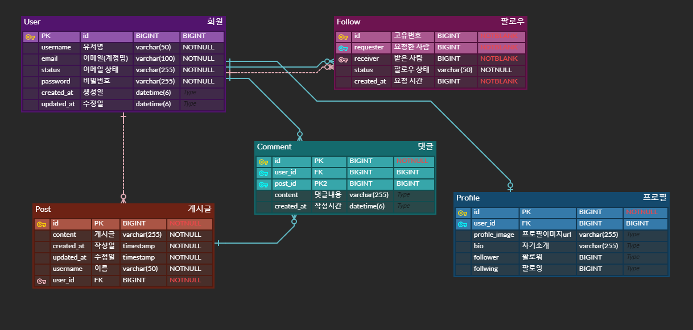

# [Spring 3기] 뉴스피드 미니 팀프로젝트

------------------------------------------------------------------------


## <span style="color: pink"> 12조 팀원 소개
<br>

| 이름                              | 직책    | MBTI   |블로그 주소|Github 주소|
|---------------------------------|-------|--------|-|-|
| <span style="color: orange">김신희 | `리더`  | `ESFP` |https://cinining.tistory.com/|https://github.com/shinheekim|
| <span style="color: orange"> 김동주  | `부리더` | `INFJ` |https://despereaux.tistory.com/|https://github.com/|
| <span style="color: orange">지민지   | `팀원`  | `ISFP` |https://velog.io/@min01/posts|https://github.com/JIMINJI1|
| <span style="color: orange">박도현   | `팀원`  | `ENFP` |https://velog.io/@parkyj3213/posts|https://github.com/Dohyeon-Parrk|

## <span style="color: pink"> API 명세서
- [API 명세서 링크 (CLICK)](https://www.notion.so/cinining/12-F4-1232cccc07af80b8af85c8be4d1c9199)
- (요청헤더는 Content-Type: application/json 로 통일)
#### <span style="color: skyblue">USER API
| API 명칭| 메소드|요청 URL| 요청 본문                                                                                      | 
|-------|----|------|--------------------------------------------------------------------------------------------|
| 회원가입  | `POST` | /api/users/register | {"email" : "이메일형식" , "username" : "이름" , "password" : "패스워드" , "confirmPassword" : "패스워드"} |
| 로그인   | `GET` | /api/users/login| {"email" : "이메일형식", "password" : "패스워드"}                                                   |
| 모든 회원 조회 | `GET` | /api/users/|
| 특정 회원 조회 | `GET` | /api/users/{id} |                                                                                            |
| 비밀번호 변경 | `PUT` | /api/users/update | {"email" : "test", "newPassword" : "string", "confirmPassword" : "string"}                 |
| 회원탈퇴  | `DELETE` | /api/users/{id} | {"password" : "string"}                                                                    |
#### <span style="color: skyblue">POST API
| API 명칭    | 메소드      | 요청 URL             | 요청 본문                              | 
|-----------|----------|--------------------|------------------------------------|
| 게시글 작성    | `POST`   | /api/post          | {"content" : "본문내용" }              |                                                      |
| 게시글 전체조회  | `GET`    | /api/post          |                                    |
| 게시글 단건 조회 | `GET`    | /api/post/{postId} |                                    |
| 게시글 수정    | `PUT`    | /api/post/{postId} | {"postId" : 1 , "content" : "본문내용"} |
| 게시글 삭제    | `DELETE` | /api/post/{postId} | {"email" : "이메일형식", "newPassword" : "패스워드", "confirmPassword" : "패스워드"} |
#### <span style="color: skyblue">PROFILE API
| API 명칭     | 메소드     | 요청 URL                      | 요청 본문                      | 
|------------|---------|-----------------------------|----------------------------|
| 프로필 조회     | `GET`   | /api/profile/{userId}       |                            |                                                      |
| 프로필 정보 수정  | `PATCH` | /api/profile/{userId}       | {"bio" : "자기소개 수정"}        |
| 프로필 이미지 수정 | `PATCH` | /api/profile/{userId}/image | {"profileImage" : "이미지경로"} |
#### <span style="color: skyblue">FOLLOW API
| API 명칭      | 메소드      | 요청 URL                         | 요청 본문                     | 
|-------------|----------|--------------------------------|---------------------------|
| 팔로우         | `POST`   | /api/follow/{receiverId}       |                           |                                                      |
| 팔로우 해제      | `DELETE` | /api/follow/{requesterId}      |       |
| 팔로우 수락      | `PATCH`  | /api/follow/{requesterId}      |  |
| 팔로우 여부      | `GET`    | /api/follow/check/{receiverId} | |
| 팔로우 조회      | `GET`    | /api/follow/followers/{userId} | |
| 팔로우 글 전체 조회 | `GET`    | /api/follow/posts              |  |
#### <span style="color: skyblue">COMMENT API
| API 명칭      | 메소드    | 요청 URL                 | 요청 본문                                              | 
|-------------|--------|------------------------|----------------------------------------------------|
| 로그인 사용자의 댓글 | `GET`  | /api/comments/{userId} |                                                    |                                                      |
| 댓글 작성       | `POST` | /api/comment/create    | {"userId" : 1 , "postId" : 1 , "content" : "댓글내용"} |
|댓글 삭제|`DELETE`|/api/comments//{commentId}/users/{userId}||

<br><br>
## <span style="color: pink">  ERD 설계

<br><br>
## <span style="color: pink"> 개요 (Overview)
Paradise는 사용자, 게시물, 사용자의 프로필, 팔로우, 그리고 댓글 관련 API를 제공하는 RESTful 서비스입니다.<br> 이 API는 사용자 관리(회원가입, 로그인 등), 게시글 작성 및 관리, 사용자 프로필 수정, 팔로우 관계 관리, 그리고 댓글 작성 기능을 제공합니다.<br> 이 서비스를 통해 다양한 소셜 기능을 구현할 수 있습니다.
<br><br>
## <span style="color: pink"> 주요 기능 (Key Features)
- #### `사용자 관리` :
    회원가입, 로그인, 비밀번호 변경, 회원탈퇴 등의 사용자 계정 관련 기능을 제공합니다. 사용자는 간편하게 계정을 생성하고 관리할 수 있습니다.
- #### `게시글 관리` :
    사용자는 게시글을 작성하고, 조회하고, 수정 및 삭제할 수 있습니다. 이를 통해 사용자 간의 의견 교환과 정보 공유가 가능합니다.
- #### `프로필 설정` :
    사용자는 자신의 프로필을 조회하고, 자기소개나 프로필 이미지를 수정하여 자신을 표현할 수 있습니다.
- #### `팔로우 기능` :
    다른 사용자를 팔로우하거나 팔로우 요청을 관리함으로써 인맥 관리를 할 수 있습니다. 팔로우 관계를 통해 팔로우한 사용자의 게시글을 쉽게 확인할 수 있습니다.
- #### `댓글 작성 및 조회` :
    게시글에 대한 댓글을 작성하고, 본인이 작성한 댓글을 조회할 수 있는 기능을 제공합니다.
  <br><br>
## <span style="color: pink"> 기술 스택 (Tech Stack)
- #### **Java**: `Java 17`
- #### **Backend**: `Spring Boot`
- #### **Database**: `MySQL`
- #### **ORM** : `JPA`
- #### **Build Tool**: `Gradle`
- #### **Security** : `JWT Token` , `Spring Security`
<br><br>
## <span style="color: pink"> 개발자 가이드 (Developer Guide)
### <span style="color: skyblue">1. 환경 변수 설정
- `application.yml` 파일에 다음 설정을 추가합니다 <br>
```yml
spring:
  profiles:
    active: prod
  datasource:
    url: ${spring.datasource.url}
    username: ${spring.datasource.username}
    password: ${spring.datasource.password}
    driver-class-name: com.mysql.cj.jdbc.Driver
  jpa:
    database: mysql
    hibernate:
      ddl-auto: update
    show-sql: true
    properties:
      hibernate:
        format_sql: true
        use_sql_comments: true
jwt:
  header: Authorization
  secret: ${JWT_SECRET}
  access-token-validity-in-milliseconds: ${JWT_ACCESS_TOKEN_VALIDITY_IN_MILLISECONDS}
```
- 추가로 MySQL 데이터베이스 연결을 위한 환경 변수를 `application-prod.yml` 을 생성하고 설정해야 합니다.
```yml
spring:
  config:
    activate:
      on-profile: prod
  datasource:
    url: jdbc:mysql://localhost:3306/paradise
    username: ${db 계정}
    password: ${password 패스워드}
jwt:
  secret: 7Iqk7YyM66W07YOA7L2U65Sp7YG065+9U3ByaW5n6rCV7J2Y7Yqc7YSw7LWc7JuQ67mI7J6F64uI64ukLg==
  access-token-validity-in-milliseconds: 3600000
```
<br><br>
### <span style="color: skyblue">2. Gradle 의존성 추가 ( Dependency Injection )
- `build.gradle` 파일에 필요한 라이브러리를 의존성 주입을 합니다.<br>
```build.gradle
dependencies {
    // JWT
    compileOnly group: 'io.jsonwebtoken', name: 'jjwt-api', version: '0.11.5'
    runtimeOnly group: 'io.jsonwebtoken', name: 'jjwt-impl', version: '0.11.5'
    runtimeOnly group: 'io.jsonwebtoken', name: 'jjwt-jackson', version: '0.11.5'
    // json
    implementation 'org.json:json:20230227'
    // Bcrypt
    implementation 'at.favre.lib:bcrypt:0.10.2'

    implementation 'org.springframework.boot:spring-boot-starter-data-jpa'
    implementation 'org.springframework.boot:spring-boot-starter-security'
    implementation 'org.springframework.boot:spring-boot-starter-validation'
    implementation 'org.springframework.boot:spring-boot-starter-web'
    compileOnly 'org.projectlombok:lombok'
    runtimeOnly 'com.mysql:mysql-connector-j'
    annotationProcessor 'org.projectlombok:lombok'
    testImplementation 'org.springframework.boot:spring-boot-starter-test'
    testImplementation 'org.springframework.security:spring-security-test'
    testRuntimeOnly 'org.junit.platform:junit-platform-launcher'
}
```
